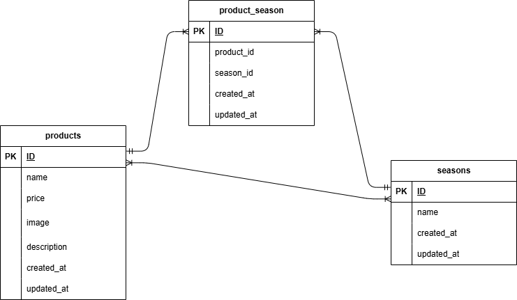

# mogitate-fruits-test2

## 概要　
このリポジトリは、確認テスト第2回の課題として作成した「果物の商品を管理するアプリケーション」です。
Laravel と Docker を使用して、ローカル環境で動作する商品管理機能を構築しています。 
マイグレーションとシーディングを通じて、商品・季節・カテゴリの初期データを自動生成できるようにしています。
これにより、環境構築後すぐに動作確認が可能です。

---

## 🛠️ 環境構築手順

### 1. リポジトリの設定
このプロジェクトのベースとなるコードを取得するために、GitHubからリポジトリをクローンします。

### 2. Docker の設定
ローカル環境に必要なサービス（PHP, MySQLなど）をDockerで構築・起動します。

以下のコマンドでDocker環境を構築・起動しました：
```bash
docker-compose up -d --build
```

### 3. Laravel のパッケージのインストール
Laravelの動作に必要な依存パッケージをインストールします。
```bash
docker-compose exec app bash
composer install
```

### 4. .env ファイルの作成
Laravelの環境設定を行うために、.envファイルを作成し、アプリケーションキーを生成します。
```bash
cp .env.example .env
php artisan key:generate
```

### 5. View ファイルの作成
商品管理機能に関連する画面を作成しました。  
主なファイル:
- `resources/views/products/index.blade.php` （商品一覧画面）
- `resources/views/products/create.blade.php` （商品登録画面）
- `resources/views/products/show.blade.php` （商品詳細画面）
- `resources/views/layouts/app.blade.php` （共通レイアウト）

### 6. CSS ファイルの作成
商品管理画面のデザインを整えるために、ページごとにスタイルを作成しました。  
主なファイル:
- `public/css/products.css` （商品一覧画面用）
- `public/css/product-create.css` （商品登録画面用）
- `public/css/product-detail.css` （商品詳細画面用）

※ 共通スタイル用の `style.css` 、リセット用の `sanitize.css` は未作成ですが、必要に応じて追加可能です。

## 🛠 使用技術（この例で使われている環境）
- PHP 8.2
- Laravel 10.0
- MySQL 8.0
- Docker (nginx, php, mysql, phpmyadmin)

## 🗂 ER図（このプロジェクトのデータ構造）
このアプリケーションのデータ構造を視覚的に把握するため、以下にER図を掲載しています。

この図では、`products` テーブルと `seasons` テーブルが「多対多」のリレーションで接続されており、  
中間テーブル `product_season` によって関係が管理されています。  
各テーブルは表形式（右揃え）で構成されており、主キー（PK）・外部キー（FK）の役割が明示されています。



※ 補足：
1. 図は draw.io（diagrams.net）にて作成し、PNG形式で保存しています。
2. 元データは `src/mogitate-fruits-test2-er.drawio` にて編集可能です。
3. PNGファイルは `assets/mogitate-fruits-test2-er.png` に保存されています。  
   → READMEではこの画像を参照しています。
4. 編集には [draw.io（diagrams.net）](https://app.diagrams.net/) を使用してください。  
　 ローカルアプリまたはブラウザ版のどちらでも編集可能です。
5. ER図の更新手順：drawioで編集 → PNG再出力 → assetsに上書き保存 → README確認  
   ※GitHub上で画像が更新されない場合は、Shift+再読み込み（Ctrl+Shift+R）などでキャッシュを強制クリアしてください。

### データ仕様（要点）

- products テーブル  
  - name: string 型（商品名）  
  - price: integer 型（価格）  
  - description: text 型（説明文）  

- seasons テーブル  
  - name: string 型（季節名：春・夏・秋・冬）  

- 中間テーブル product_season  
  - product_id: 外部キー（products.id）  
  - season_id: 外部キー（seasons.id）  

- Seeder では、商品データを投入し、対応する季節データと関連付けて登録  
  - 例:  
    ```php
    $seasonIds = Season::whereIn('name', $seasonNames)->pluck('id');
    $product->seasons()->attach($seasonIds);
    ```

### ダミーデータの作成

- seasons テーブル: Seeder を使用して以下 4 件を作成  
  1. 春  
  2. 夏  
  3. 秋  
  4. 冬  

- products テーブル: Seeder を使用して複数の商品データを作成  
  - name, price, description を持つ商品を投入  
  - 各商品は複数の季節と関連付けられる  

- 中間テーブル product_season:  
  - ProductSeeder 内で `$product->seasons()->attach($seasonIds);` を使用し、  
    商品と季節の多対多関係を登録
 
## 🌐 ローカル環境での確認用URL
- アプリケーション: [http://localhost/](http://localhost/)  
  （商品一覧は [http://localhost/products](http://localhost/products) から確認できます）
- phpMyAdmin: [http://localhost:8080/](http://localhost:8080/)

## 実装状況
- [x] Docker 環境構築 (nginx, php, mysql, phpmyadmin)
- [x] Laravel プロジェクト作成
- [x] モデル・マイグレーション作成（products, seasons, 中間テーブル）
- [x] Seeder による初期データ投入（商品・季節・関連付け）
- [x] Blade による画面作成（商品一覧・詳細・登録フォーム）
- [x] バリデーション（商品登録フォームの入力チェック）
- [x] エラーメッセージの表示整備（ユーザーにわかりやすいフィードバック）
- [x] デザイン調整（レイアウトやスタイルの改善）
- [ ] 商品検索機能（部分一致検索）
- [ ] 商品並び替え機能（価格の高い順／低い順）

## 提出にあたって
- main ブランチにコミット済み  
- `.env` や `vendor/` ディレクトリは、セキュリティ・再現性の観点からコミット対象外としています

### 商品画像のアップロード機能

- 商品登録フォームからローカルの画像ファイルを選択してアップロードできます。
- アップロードされた画像は `storage/app/public/images` に保存され、DBにはファイル名のみが保存されます。
- 表示時には `asset('storage/' . $product->image)` を利用し、`public/storage` 経由で画像を参照しています。
- 初回のみ `php artisan storage:link` を実行して、`storage` ディレクトリと `public` ディレクトリを接続する必要があります。

### ダミーデータの初期化について

- `php artisan migrate:fresh --seed` を実行することで、productsテーブルのダミーデータ10件が再生成されます。
- 登録テストで追加した商品データが混在している場合も、このコマンドで初期化できます。
- Seederファイルは `database/seeders/ProductSeeder.php` に記述しています。

## ライセンス
このリポジトリは学習・確認テスト用に作成したものであり、商用利用は想定していません。
